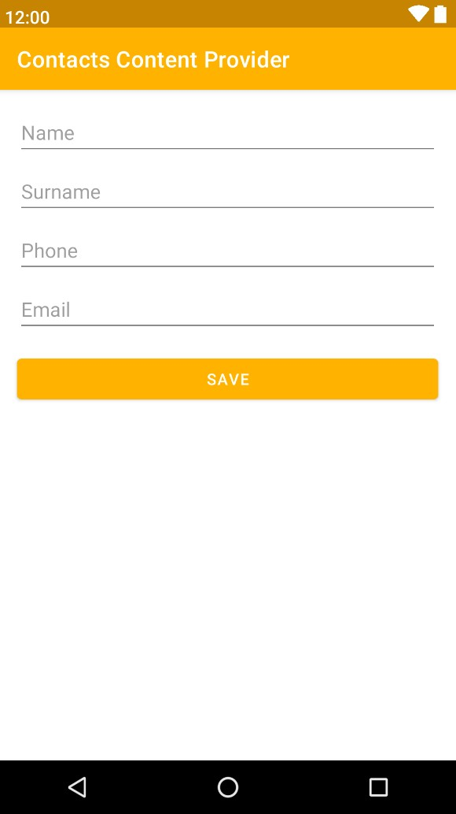

# Contacts Content Provider Example

This application allows to work with contacts on the device using a <a href="https://developer.android.com/reference/android/content/ContentResolver" target="_blank"><i>ContentResolver</i></a> and a <a href="https://developer.android.com/reference/android/database/Cursor" target="_blank"><i>Cursor</i></a> to move through the <a href="https://developer.android.com/reference/android/provider/ContactsContract" target="_blank"><i>ContactsContract</i></a>.

## About

### Functionality
- View contacts on the device
- Adding contact to the device
- View contact detail data
- Removing contact from the device

### UI
- [Material 2](https://material.io/develop/android)
- [Navigation component](https://developer.android.com/jetpack/androidx/releases/navigation)
- [Glide](https://github.com/bumptech/glide)

### Features

- [Kotlin Flow](https://developer.android.com/kotlin/flow)
- [Coroutines](https://developer.android.com/kotlin/coroutines)
- [MVVM architecture](https://developer.android.com/topic/architecture)
- [Viewbinding Extensions](https://developer.android.com/topic/libraries/view-bindinge)

### Permissions
- [Permissions Dispatcher](https://github.com/permissions-dispatcher/PermissionsDispatcher)
